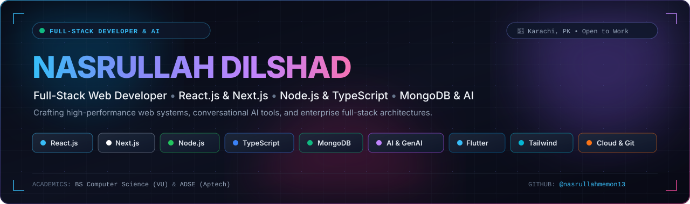

<div align="center">

<!-- HERO BANNER -->


<br/>

<!-- DYNAMIC TYPING SVG -->
<a href="https://github.com/nasrullahmemon13">
  
</a>

<p align="center">
  <a href="https://www.linkedin.com/in/nasrullah-dilshad-6419a734a">
    
  </a>
  <a href="https://orcid.org/0009-0007-7736-7248">
    
  </a>
  <a href="mailto:nasrullahdilshad0@gmail.com">
    
  </a>
  <a href="https://wa.me/923161407786">
    
  </a>
  <a href="https://github.com/nasrullahmemon13">
    
  </a>
</p>

<!-- STATUS PILLS -->
<p align="center">
  <code>📍 Karachi, Pakistan (UTC+05:00)</code> &nbsp;•&nbsp;
  <code>🎓 BS Computer Science (VU)</code> &nbsp;•&nbsp;
  <code>📜 ADSE (Aptech)</code> &nbsp;•&nbsp;
  <code>🟢 Open to Opportunities</code>
</p>

</div>

---

### 💫 About Me

> *"Code is the closest thing we have to magic — it builds worlds from nothing."* — **Nasrullah Dilshad**

I am a passionate **Full-Stack Web Developer, Mobile App Developer, and Data Analyst** based in Karachi, Pakistan. I specialize in building responsive, high-performance web applications, robust RESTful APIs, and intelligent AI-driven systems.

- 🎓 Pursuing a **Bachelor of Science in Computer Science** at the **Virtual University of Pakistan (VU)** (2024 – Present).
- 📜 Completing the 3-Year **Advanced Diploma in Software Engineering (ADSE / DISM)** at **Aptech Computer Education (Shah-e-Faisal)**.
- ⚡ Experienced across the entire software development lifecycle: frontend state management, server architectures, database schema design, and cloud deployments.
- 🤖 Specialized in **AI & Multi-LLM integrations** (OpenAI GPT, Google Gemini, Groq), automated document generators, and bilingual voice chatbots.

---

### 🛠️ Core Technology Stack

<div align="center">

| Domain | Technologies & Frameworks |
| :--- | :--- |
| **Frontend Development** |          |
| **Backend & APIs** |       |
| **Databases & Cloud** |        |
| **Mobile & Analytics** |     |
| **AI & Developer Tools** |       |

</div>

---

### 📊 GitHub Activity & Real-Time Stats

<div align="center">

<table border="0">
  <tr>
    <td align="center" width="50%">
      
    </td>
    <td align="center" width="50%">
      
    </td>
  </tr>
  <tr>
    <td colspan="2" align="center">
      
    </td>
  </tr>
</table>

</div>

---

### ⭐ Featured Projects

<table>
  <tr>
    <td width="50%" valign="top">
      <h3>🤖 <a href="https://github.com/nasrullahmemon13/Inside-Hunters-SFC">Inside-Hunters-SFC</a></h3>
      <p><b>AI Meeting Intelligence &amp; Document Synthesis Platform</b></p>
      <p>An enterprise-grade meeting intelligence system that ingests transcripts, performs automated decision tracking, extracts actionable tasks, and generates executive summaries and formatted PDF/DOCX reports.</p>
      <p>
        <a href="https://inside-hunters-sfc.vercel.app"></a>
        
        
        
      </p>
    </td>
    <td width="50%" valign="top">
      <h3>🏨 <a href="#-preserved-repository-file-guide-portfolio-aurora--advanced-edition">LuxuryStay (Aptech Capstone)</a></h3>
      <p><b>Full-Stack Luxury Hotel Management &amp; Reservation Platform</b></p>
      <p>A 40+ page enterprise web application with 10+ REST API routes, secure JWT authentication, dynamic room catalog, real-time availability checking, and customer reservation dashboards.</p>
      <p>
        
        
        
        
      </p>
    </td>
  </tr>
  <tr>
    <td width="50%" valign="top">
      <h3>🏋️ <a href="https://github.com/nasrullahmemon13/ElevateX-Fitness">ElevateX-Fitness</a></h3>
      <p><b>Comprehensive Gym, Health Club &amp; Fitness Store</b></p>
      <p>A multi-page modern fitness hub featuring responsive interactive layouts, membership onboarding forms, workout catalogs, and a dynamic fitness store.</p>
      <p>
        <a href="https://nasrullah-nd.github.io/ElevateX-Fitness/"></a>
        
        
        
      </p>
    </td>
    <td width="50%" valign="top">
      <h3>✨ <a href="https://github.com/nasrullahmemon13/nasrullahmemon13">Aurora Portfolio &amp; ND-Bot</a></h3>
      <p><b>Voice-Enabled AI Portfolio &amp; Interactive Web Experience</b></p>
      <p>Interactive portfolio with constellation particle physics, 3D card tilt, cursor spotlight, and a custom bilingual (English &amp; Roman Urdu) voice chatbot powered by Web Speech API.</p>
      <p>
        
        
        
      </p>
    </td>
  </tr>
  <tr>
    <td width="50%" valign="top">
      <h3>🛠️ <a href="https://github.com/nasrullahmemon13/assigment-sevices-provider-for-home">Home Services Provider Platform</a></h3>
      <p><b>On-Demand Residential Maintenance Booking Hub</b></p>
      <p>End-to-end home service request portal featuring service pricing tiers, booking order forms, FAQ accordions, and JSON data integration.</p>
      <p>
        
        
        
      </p>
    </td>
    <td width="50%" valign="top">
      <h3>🌐 <a href="https://github.com/nasrullahmemon13/Portfolio-N">Portfolio-N</a></h3>
      <p><b>Client-Side Portfolio Architecture &amp; UI Design</b></p>
      <p>Clean, responsive portfolio template engineered for personal branding, showcasing work, certifications, and project galleries.</p>
      <p>
        <a href="https://nasrullah-nd.github.io/Portfolio-N/"></a>
        
        
      </p>
    </td>
  </tr>
</table>

---

### 🎯 Current Focus & 2026 Roadmap

- 🔭 **Next.js 15 & Full-Stack TypeScript**: Designing edge-rendered applications with server actions and streaming UI.
- 🧠 **Agentic AI & Retrieval-Augmented Generation (RAG)**: Pairing LLMs with MongoDB Vector Search for contextual enterprise automation.
- 📱 **Cross-Platform Mobile Engineering**: Building high-speed mobile apps with Flutter and Dart.
- 📊 **Advanced Data Analytics**: Expanding machine learning algorithms and statistical data pipelines with R and Python.

---

### 🎓 Verified Education & Qualifications

- 🎓 **Bachelor of Science in Computer Science (BS CS)** — *Virtual University of Pakistan* (2024 – Present)
- 📜 **Advanced Diploma in Software Engineering (ADSE / DISM 3-Year Program)** — *Aptech Computer Education, Shah-e-Faisal, Karachi* (2023 – Present)
- 🏆 **LuxuryStay Hotel Management Final Project** — Lead Full-Stack Architect (Aptech Capstone)
- 📜 **Intermediate in Pre-Engineering** — *Board of Intermediate Education, Sindh* (2024)
- 📜 **Diploma in Information Technology (DIT)** — *Agha Computer Center, Karachi* (2021)

---

### 📂 Preserved Repository File Guide: Portfolio (Aurora / Advanced Edition)

<details>
<summary><b>Click to expand original repository documentation &amp; architecture notes</b></summary>
<br/>

The files hosted within this repository (`nasrullahmemon13/nasrullahmemon13`) represent the **Aurora / Advanced Edition** of Nasrullah Dilshad's personal portfolio website:

#### Files
- `index.html` — the page
- `css/style.css` — compiled Tailwind CSS (ready to use, no build step needed to view it)
- `css/input.css` — Tailwind source + all custom animation CSS (edit this, then rebuild)
- `js/script.js` — core animations: preloader, constellation canvas, custom cursor, magnetic buttons, scroll reveals, animated counters, skill bars, 3D tilt card, timeline draw, marquee, mobile menu, parallax blobs, button ripple, cursor spotlight, letter-stagger heading
- `js/chatbot.js` — a small rule-based JavaScript chatbot ("ND-Bot") that answers visitor questions about skills, the LuxuryStay project, education and contact info
- `assets/cv/Nasrullah-Dilshad-CV.pdf` — downloadable resume (linked from the navbar, hero, contact section, mobile menu, and footer)
- `assets/img/project-*.svg` — stylized preview "screenshots" of the LuxuryStay project. These are illustrative mockups, not real screenshots (I couldn't pull actual ones from the repo) — swap in real PNG/JPG screenshots anytime by replacing these files or updating the `` paths in the Work section of `index.html`.
- `tailwind.config.js` / `package.json` — only needed if you want to rebuild the CSS

#### New in this version
- Real project preview gallery in the Work section
- GitHub + LinkedIn links throughout (nav isn't cluttered, but hero/contact/footer have them)
- "Download CV" button in the navbar, hero, contact section, mobile menu and footer
- ND-Bot — a simple JS chatbot (bottom-right bubble) for quick visitor Q&A
- Extra animation layer: parallax background blobs, button ripple clicks, a soft cursor spotlight, and a letter-by-letter stagger on the hero heading

#### How to use
Open `index.html` in a browser, or upload the whole folder to GitHub Pages / Netlify / Vercel.

#### To edit & rebuild the CSS later
```bash
npm install -D tailwindcss@3
npx tailwindcss -i ./css/input.css -o ./css/style.css --minify
```

#### Notes
- Respects `prefers-reduced-motion` (cursor, canvas, tilt, parallax, chat animations all turn off).
- Custom cursor and tilt effects are desktop-only (disabled on touch devices).
- ND-Bot runs entirely in the browser — no API key, no server, no data leaves the page.
- All content (skills, project, education, contact) is pulled directly from your CV.

</details>

---

### 🤝 Connect & Collaborate

I am always open to discussing new opportunities, open-source initiatives, freelance projects, and innovative software ideas.

<p align="center">
  <a href="https://www.linkedin.com/in/nasrullah-dilshad-6419a734a">
    
  </a>
  <a href="https://orcid.org/0009-0007-7736-7248">
    
  </a>
  <a href="mailto:nasrullahdilshad0@gmail.com">
    
  </a>
  <a href="https://wa.me/923161407786">
    
  </a>
  <a href="https://github.com/nasrullahmemon13">
    
  </a>
</p>

<p align="center">
  <sub>Built with ❤️ by <b>Nasrullah Dilshad</b> • © 2026 All Rights Reserved</sub>
</p>