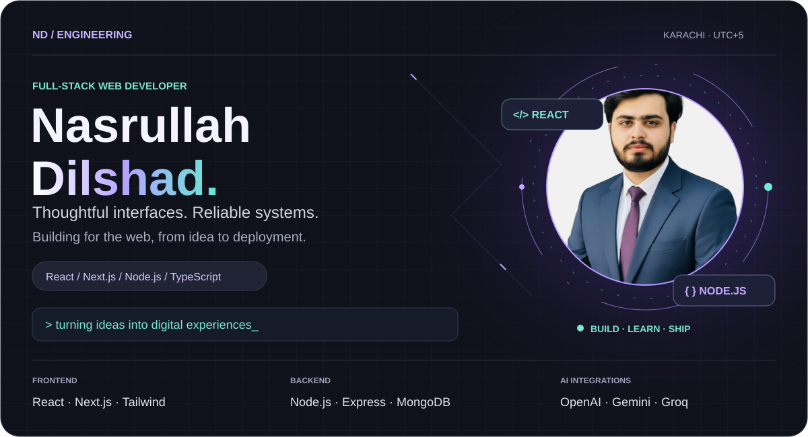
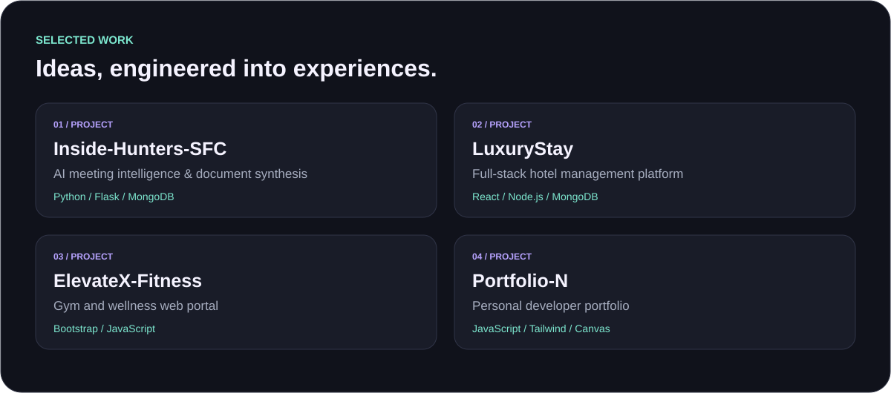

<div align="center">
  
</div>

<p align="center">
  <a href="https://www.linkedin.com/in/nasrullah-dilshad-6419a734a">LinkedIn</a> &nbsp; / &nbsp;
  <a href="mailto:nasrullahdilshad0@gmail.com">Email</a> &nbsp; / &nbsp;
  <a href="./assets/cv/Nasrullah-Dilshad-CV.pdf">Resume</a> &nbsp; / &nbsp;
  <a href="https://orcid.org/0009-0007-7736-7248">ORCID</a>
</p>

### A little about me

I'm Nasrullah, a full-stack web developer based in Karachi, Pakistan. I build responsive interfaces, backend APIs, and AI-powered web experiences. I care about clean code, useful products, and learning through building.

- **Frontend:** JavaScript, TypeScript, React, Next.js, Tailwind CSS
- **Backend:** Node.js, Express, Python, Flask, REST APIs
- **Data & tools:** MongoDB, Mongoose, SQLite, Git, Postman, Figma
- **Education:** BS in Computer Science (VU) · ADSE (Aptech)



| Project | Explore |
| :--- | :--- |
| Inside-Hunters-SFC — AI meeting intelligence | [View repository](https://github.com/nasrullahmemon13/Inside-Hunters-SFC) |
| LuxuryStay — Hotel management | [Browse my repositories](https://github.com/nasrullahmemon13?tab=repositories) |
| ElevateX-Fitness — Fitness web portal | [View repository](https://github.com/nasrullahmemon13/ElevateX-Fitness) |
| Portfolio-N — Developer portfolio | [View repository](https://github.com/nasrullahmemon13/Portfolio-N) |

<details>
<summary><b>Contribution activity</b></summary>
<br />
<picture>
  <source media="(prefers-color-scheme: dark)" srcset="https://raw.githubusercontent.com/nasrullahmemon13/nasrullahmemon13/output/github-contribution-grid-snake-dark.svg" />
  
</picture>
</details>

<details>
<summary><b>📂 Click to expand preserved repository documentation &amp; architecture notes</b></summary>
<br/>

The files hosted within this repository (`nasrullahmemon13/nasrullahmemon13`) represent the **Aurora / Advanced Edition** of Nasrullah Dilshad's personal portfolio website:

#### Files
- `index.html` — the page
- `css/style.css` — compiled Tailwind CSS (ready to use, no build step needed to view it)
- `css/input.css` — Tailwind source + all custom animation CSS (edit this, then rebuild)
- `js/script.js` — core animations: preloader, constellation canvas, custom cursor, magnetic buttons, scroll reveals, animated counters, skill bars, 3D tilt card, timeline draw, marquee, mobile menu, parallax blobs, button ripple, cursor spotlight, letter-stagger heading
- `js/chatbot.js` — a small rule-based JavaScript chatbot ("ND-Bot") that answers visitor questions about skills, the LuxuryStay project, education and contact info
- `assets/cv/Nasrullah-Dilshad-CV.pdf` — downloadable resume (linked from the navbar, hero, contact section, mobile menu, and footer)
- `assets/img/project-*.svg` — stylized preview "screenshots" of the LuxuryStay project. These are illustrative mockups, not real screenshots (I couldn't pull actual ones from the repo) — swap in real PNG/JPG screenshots anytime by replacing these files or updating the `` paths in the Work section of `index.html`.
- `tailwind.config.js` / `package.json` — only needed if you want to rebuild the CSS

#### New in this version
- Real project preview gallery in the Work section
- GitHub + LinkedIn links throughout (nav isn't cluttered, but hero/contact/footer have them)
- "Download CV" button in the navbar, hero, contact section, mobile menu and footer
- ND-Bot — a simple JS chatbot (bottom-right bubble) for quick visitor Q&A
- Extra animation layer: parallax background blobs, button ripple clicks, a soft cursor spotlight, and a letter-by-letter stagger on the hero heading

#### How to use
Open `index.html` in a browser, or upload the whole folder to GitHub Pages / Netlify / Vercel.

#### To edit & rebuild the CSS later
```bash
npm install -D tailwindcss@3
npx tailwindcss -i ./css/input.css -o ./css/style.css --minify
```

#### Notes
- Respects `prefers-reduced-motion` (cursor, canvas, tilt, parallax, chat animations all turn off).
- Custom cursor and tilt effects are desktop-only (disabled on touch devices).
- ND-Bot runs entirely in the browser — no API key, no server, no data leaves the page.
- All content (skills, project, education, contact) is pulled directly from your CV.

</details>

<p align="center"><sub>Nasrullah Dilshad · Building with intention.</sub></p>
